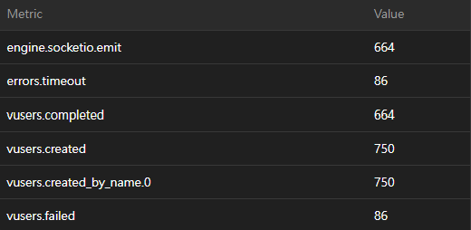
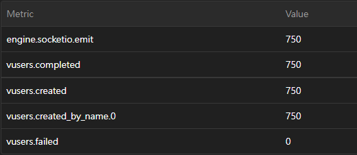
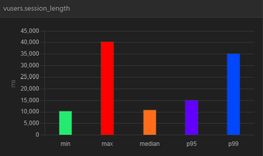
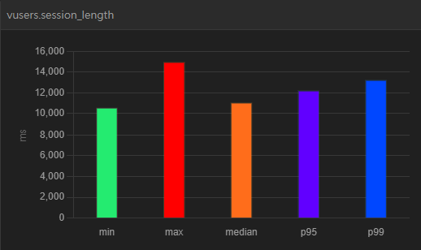

# Solid-Snake

## 多人線上貪食蛇遊戲

16-bit 風格的貪食蛇遊戲，功能包含: 即時對戰系統、登入系統、等級系統、排行榜、遊戲生涯紀錄

## 壓力測試

使用 [Artillery](https://www.artillery.io/) 針對 socket.io `startGame` event 進行壓力測試，目的是測試伺服器最高能承受多少玩家同時加入，測試報告如下：

### 測試環境

- **Server**: AWS EC2 t2.micro (記憶體 1G)
- **Redis**: AWS ElastiCache
- **Mysql**: AWS RDS
- **Test Tool**: Artillery
- **Load Balancer**: AWS Application Load Balancer

### 測試流程

- 先測試單台瓶頸點，再以同樣條件測試使用 Load Balancer 查看差異

### 測試條件

- 每秒25個新連線，持續30秒，連續測試5次

### CPU 和記憶體使用情况

#### CPU 使用量

- **單台情況下**: CPU 使用量最高到 98%

- **開啟 ALB 情況下**: server1 CPU 使用量最高到 40%, server2 CPU 使用量最高到 24%

#### 記憶體使用量

**單台情況下**: 記憶體使用量最高到 834MB

**開啟 ALB 情況下**: server1 記憶體使用量最高到 448MB, server2 記憶體使用量最高到 442MB

### 測試指標說明

- **vusers.created**: Number of VU's created.
- **vusers.failed**: Number of failed VU's.
- **vusers.completed**: Number of completed VU's.
- **engine.socketio.emit_rate**: Rate of Socket.io messages emitted over the time period.
- **vusers.session_length.mean**: How long it took for virtual users to complete each session.

### 測試圖

以下圖表為壓力測試期間的指標：

#### Metric

**單台情況下**:

**開啟 ALB 情況下**:

#### vuser.session_length

**單台情況下**:

**開啟 ALB 情況下**:

## 測試總結

1. 單台的瓶頸點約在每秒25個連線，測試到第三次時 EC2 掛掉要重開。
2. 使用 ALB 能觀察到 CPU 和記憶體使用率和單台有明顯的差距。
3. 開啟 Sticky Session 似乎會讓流量分配不夠平均，可以從兩台 server 的 CPU 使用率觀察到。