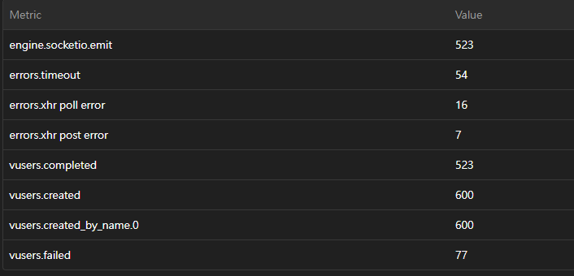
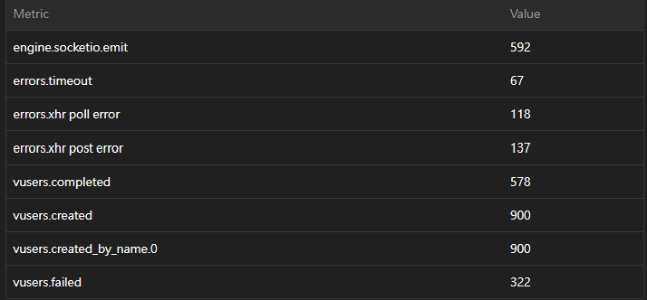

# Solid-Snake

## 多人線上貪食蛇遊戲

16-bit風格的貪食蛇遊戲，功能包含: 即時對戰系統、登入系統、等級系統、排行榜、遊戲生涯紀錄

## 壓力測試結果

使用 [Artillery](https://www.artillery.io/) 對 `startGame` event進行壓力測試，測試结果如下：

### 測試環境

- **Server**: AWS EC2 t2.micro (記憶體 1G)
- **Redis**: AWS ElastiCache
- **Test Tool**: Artillery

### 測試條件

- 持續30秒，每秒鐘20 ~ 30個連線

### CPU 和記憶體使用情况

#### CPU 使用量

**無開啟 ALB 情況下**: 測試期間，CPU 使用量最高在 84.7%

**開啟 ALB 情況下**: 測試期間，若開啟 Sticky Session ，有機率其中一台會掛掉， 另一台 CPU 使用量最高在 30%

#### 記憶體使用量

**無開啟 ALB 情況下**: 測試期間，記憶體使用量最高在 820MB

**開啟 ALB 情況下**: 測試期間，若開啟 Sticky Session ，有機率其中一台會掛掉， 另一台記憶體使用量最高在 300MB

### 測試圖

以下圖表為壓力測試期間的指標：

#### Metric

**無開啟 ALB 情況下**:

**開啟 ALB 情況下**:

#### vuser.session_length

**無開啟 ALB 情況下**:

**開啟 ALB 情況下**:

## 測試總結

1. 單台的瓶頸點約在每秒20~30個連線，越靠近瓶頸點 vuser.failed 會飆升。
2. 使用 ALB 能觀察到使用 Sticky Session 能會導致 ALB 的分配不均。